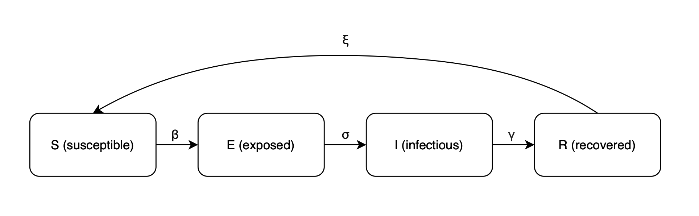
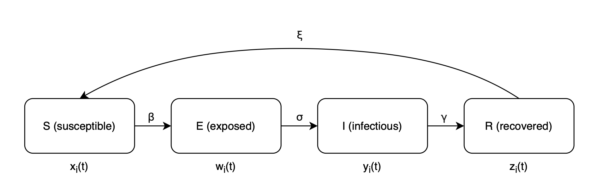

# Теоретическое описание объекта исследования

Объектом исследования выпускной квалификационной работы является процесс распространения компьютерного вируса. На основании эпидемиологической модели в средствах эмуляции реализуется поведение червя Морриса. Существует несколько подходов к математическому моделированию, отличающихся по набору рассматриваемых характеристик объекта исследования. 

В работе используется мультимодельный подход, повышающий достоверность и точность результатов. Строится натурная модель и проводится научный эксперимент, где моделируется поведение червя Морриса. Для достижения целей исследования была изучена научная литература по теме. 

## Компартментные эпидемиологические модели

Компартментная модель -- математическая модель, которая описывает процессы взаимодействия различных субъектов (например, особей) из разных групп (компартментов) в течение времени. Каждый субъект принадлежит одной группе, при этом внутри каждой группы субъекты неразличимы.

Одной из простейших компартментных моделей является модель распространения эпидемий SIR. Эта модель была создана Уильямом Кермаком и Андерсоном МакКендриком в 1927 году. Все особи популяции в данном модели делятся на три группы:

- S (susceptible) - здоровые особи, подверженные заболеванию;
- I (infectious) - зараженные особи, распространяющие болезнь;
- R (recovered) - переболевшие особи, приобретшие иммунитет.

Однако, во многих болезнях есть инкубационных период, во время которого особь заражена, но пока не заразна. Так появилась модель SEIR, где присутствует четвертая группа E (exposed) - особи, находящиеся в латентном периоде заболевания. Такая модель повышает точность моделирования инфекционных заболеваний, например, COVID-19.

Мы будем рассматривать замкнутую популяцию, где отсутствуют процессы рождаемости и смертности. Тогда можно описать эволюцию особи следующей диаграммой:

$$
S \xrightarrow{\beta} E \xrightarrow{\sigma} I \xrightarrow{\gamma} R
$$

Модель описывается системой дифференциальных уравнений:

$$
\begin{cases}
\begin{aligned}
\frac{dS}{dt} &= -\frac{\beta SI}{N}, \\
\frac{dE}{dt} &= \frac{\beta SI}{N} - \sigma E, \\
\frac{dI}{dt} &= \sigma E - \gamma I, \\
\frac{dR}{dt} &= \gamma I, \\
N &= S(t) + E(t) + I(t) + R(t),
\end{aligned}
\end{cases}
$$

где

- $\beta$ - коэффициент заражения (вероятность того, что контакт между восприимчивым и заражённым приводит к новому заражению $S \rightarrow E$);
- $\sigma$ - коэффициент инкубационного перехода (вероятность того, что зараженный индивид становится заразным $E \rightarrow I$);
- $\gamma$ - коэффициент выздоровления (вероятность того, что заражённый индивид выздоравливает $I \rightarrow R$).

Еще одной модификацией модели SIR является модель SEIRS. В жизни у определенной части переболевших особей иммунитет со временем ослабевает. Модель SEIRS допускает переход особей из состояния выздоровевших в восприимчивое состояние.

Диаграмма эволюции особи выглядит следующим образом (рис. [-@fig-seirs_diagram]).

{ #fig-seirs_diagram width=70% }

Система дифференциальных уравнений для модели SEIRS имеет вид:

$$
\begin{cases}
\begin{aligned}
\frac{dS}{dt} &= -\frac{\beta S I}{N} + \xi R, \\
\frac{dE}{dt} &= \frac{\beta S I}{N} - \sigma E, \\
\frac{dI}{dt} &= \sigma E - \gamma I, \\
\frac{dR}{dt} &= \gamma I - \xi R \\
N &= S(t) + E(t) + I(t) + R(t),
\end{aligned}
\end{cases}
$$

где

- $\xi$ - вероятность потери иммунитета (вероятность того, что выздоровевший индивид со временем возвращается в категорию восприимчивых $R \rightarrow S$).

Если приток восприимчивых в популяцию достаточно велик, система в установившемся состоянии переходит в эндемическое равновесие (устойчивое состояние системы, в котором инфекция сохраняется на постоянном уровне: не исчезает и не угасает), сопровождаемое затухающими колебаниями численности заболевших.

Классические модели SIR/SEIR описывают усреднённую динамику инфекционного процесса в популяции и не учитывают структуру взаимодействий между её особями. В реальных же системах — например, в сетях Интернета вещей (IoT) — заражение распространяется по связям между конкретными устройствами, аналогично тому, как в популяции особи контактируют не со всеми, а только с соседями.

Для учёта такого взаимодействия используется метод NIMFA (N-Intertwined Mean-Field Approximation). В нём каждая особь из классической модели рассматривается как отдельный узел графа, а вероятность её заражения определяется степенью заражённости соседних узлов.

В данной работе рассматривается модель SEIRS-NIMFA, описанная в работе [@QuirogaSanchez2025], которая объединяет принципы SEIRS-модели и сетевого приближения NIMFA. В отличие от усреднённых моделей, здесь анализируется общая эволюция сети (количество элементов в каждом компартменте) и  индивидуальное состояние каждого узла. Исследование оценивает эффективность различных стратегий кибербезопасности с помощью методов, применяемых в биологической эпидемиологии.  

Вместо того чтобы рассматривать фактическое состояние каждого устройства в сети и все возможные комбинации состояний для N узлов на каждом временном шаге, модель учитывает вероятности для каждого компартмента.

Метод NIMFA описывает вероятности заражения $p_i(t)$ для каждого узла $i$ во времени с помощью дифференциального уравнения:

$$
\frac{dp_i}{dt} = -\delta p_i(t) + (1 - p_i(t))\beta \sum_{j=1}^{N} a_{ij} p_j(t),
$$

где

- $p_i(t)$ — вероятность того, что узел i заражён в момент времени t;
- $\beta$ — коэффициент заражения;
- $\delta$ — коэффициент восстановления (скорость устранения заражения);
- $a_{ij}$ — элемент матрицы смежности, определяющий связь между узлами i и j (т.е., если вершины графа связаны $a_{ij} = 1$, иначе - 0).

Таким образом, вероятность заражения конкретного узла зависит от состояния его соседей и от параметров распространения вредоносного ПО.

Для каждого устройства $i$ вводятся вероятности нахождения в четырёх состояниях:
$$
x_i(t),\; w_i(t),\; y_i(t),\; z_i(t),
$$

соответствующие компартментам S, E, I, R, при этом выполняется нормировка:

$$
x_i(t) + w_i(t) + y_i(t) + z_i(t) = 1.
$$

Эволюцию особи можно описать следующей диагрмаммой (рис. [-@fig-seirs_nimfa_diagram]).

{ #fig-seirs_nimfa_diagram width=70% }

Скорость заражения узла $i$ зависит от вероятности заражённости его соседей и выражается как:

$$
b_i(t) = \beta_i \sum_{j=1}^{N} a_{ij} y_j(t),
$$

где $a_{ij}$ — элемент матрицы смежности, показывающий наличие связи между узлами.

Модель SEIRS-NIMFA описывается следующей системой дифференциальных уравнений:

$$
\begin{cases}
\begin{aligned}
\frac{dx_i}{dt} &= -b_i(t)x_i + \gamma_i z_i,\\
\frac{dw_i}{dt} &= b_i(t)x_i - \alpha_i w_i, \\
\frac{dy_i}{dt} &= \alpha_i w_i - \delta_i y_i,\\
\frac{dz_i}{dt} &= \delta_i y_i - \gamma_i z_i,
\end{aligned}
\end{cases}
$$

где

- $\beta_i$ — вероятность заразиться при контакте с инфицированным соседом ($S \rightarrow E$);
- $\alpha_i$ — вероятность перехода из инкубационного периода в зараженное состояние ($E \rightarrow I$);
- $\delta_i$ — вероятность выздоровления ($I \rightarrow R$);
- $\gamma_i$ — вероятность потери иммунитета и возвращения в восприимчивое состояние ($R \rightarrow S$).

## Червь Морриса

Червь Морриса был разработан Робертом Таппаном Моррисом и запущен 2 ноября 1988 года в Массачусетском технологическом институте. Он был задуман для оценки размера сети Интернет, но привел к заражению и выключению тысяч компьютеров. 

Принцип работы червя заключается в распространении вируса путем самокопирования. Загрузчик попадает в заражаемую систему благодаря уязвимостям в почтовом сервере Sendmail, сервисах Finger или, если воспользоваться уязвимостью не получается, использует консоль удаленного администрирования rsh/rexec с подбором паролей по словарю. Он адаптируется к особенностям системы и устанавливает канал связи с внешним источником. При адаптации определяются адреса необходимых ему системных вызовов, свой собственный адрес размещения в памяти, текущий уровень привилегий и другие данные, необходимые для заражения системы. Далее по установленному каналу связи транспортируется основное тело червя через TСP/IP-соединение или по средствам услуг FTP, через POP3- и SMTP-протоколы. 

В зараженном компьютере червь маскируется, меняет имя своего процесса и удаляет временные файлы. Атакуя новое устройство, вирус проверяет, инфицировано ли оно, и случайным образом заменяет копии вируса при их наличии. Из-за слишком частой перезаписи и случилась эпидемия червя, так как размножилось огромное количество копий и произошла ошибка переполнения. 

При построении натурной модели в данном исследовании также будет использоваться принцип самокопирования червя для распространения компьютерного вируса в сети.