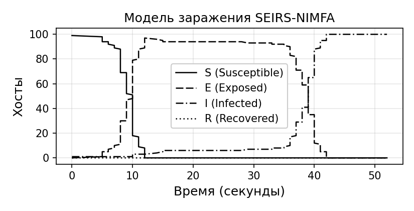
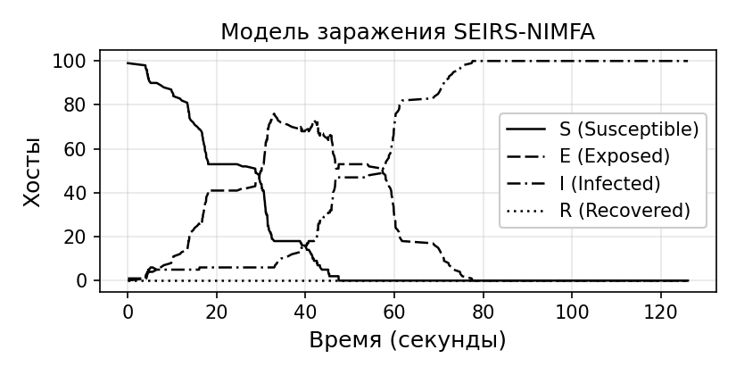

# Обзор инструментов моделирования

## Установка Kathará

### Установка на macOS 

Для установки необходимо иметь macOS 14 и выше. Kathará поддерживается как для x64, так и для arm64 архитектур. Для ее работы необходимо, чтобы был установлен и запущен Docker, поэтому для начала обратимся к инструкции по его установке.

Необходимо:

1. Скачать установщик в формате `.dmg` с официального сайта по следующей ссылке https://docs.docker.com/desktop/release-notes/
2. Дважды щелкнуть на файл Docker.dmg, чтобы открыть установщик, затем перетащить значок Docker в папку «Программы». По умолчанию Docker Desktop устанавливается в папку /Applications/Docker.app.
3. Дважды щелкнуть по Docker.app в папке «Программы», чтобы запустить Docker. Установка завершена успешно.

Есть два варианта, как установить Kathará: загрузив релизный пакет с GitHub или используя Homebrew.

В первом случае необходимо:

1. Скачать установочный файл в выбранный вами каталог из раздела Release в официальном репозитории Kathará.
2. Запустить мастер установки и следовать инструкциям.
3. Не забыть запустить Docker перед использованием Kathará.

При установке через Homebrew шагов меньше. В терминале необходимо ввести следующие команды:

```shell
brew tap KatharaFramework/Kathara
brew install --cask Kathara
```

### Установка на Linux

Kathará может быть установлена на всех основных дистрибутивах Linux. Для установки Docker можно воспользоваться официальной инструкцией по установке, доступной на официальном сайте Docker.

Рекомендуется установить эмулятор терминала xterm, который Kathará использует по умолчанию. Команда установки зависит от используемого дистрибутива:

```
sudo apt install xterm      # для систем на базе Debian/Ubuntu
sudo yum install xterm      # для систем на базе Red Hat/Fedora
sudo pacman -S xterm        # для Arch Linux
```

#### Ubuntu

Kathará предоставляет готовые бинарные пакеты для архитектур amd64 и arm64. Для установки необходимо придерживаться следующей инструкции:

1. Добавить открытый ключ Kathará в систему: `sudo apt-key adv --keyserver keyserver.ubuntu.com --recv-keys 21805A48E6CBBA6B991ABE76646193862B759810`.
2. Добавить репозиторий Kathará: `sudo add-apt-repository ppa:Katharaframework/Kathara`.
3. Обновить список пакетов: `sudo apt update`.
4. Установить Kathará: `sudo apt install Kathara`.

#### Arch-based

Установка возможна двумя способами: из готового бинарного пакета или из исходников через AUR (Arch User Repository).

1. Установка из бинарного файла
	1. Скачайте файл Kathará в формате `.pkg.tar.zst` из раздела Release.
	2. Перейдите в каталог с файлом и выполните команду: `sudo pacman -U <Kathara_PKG_FILE>.pkg.tar.zst`.
2. Установка из AUR (исходные файлы)
	1. Клонируйте репозиторий Kathará из AUR: `git clone https://aur.archlinux.org/Kathara.git`.
	2. Перейдите в созданный каталог: `cd Kathara`.
	3. Соберите и установите пакет: `makepkg -si`. Эта команда автоматически выполнит сборку пакета из исходников и установит его в систему.

### Установка на Windows

Установка доступна для 10 и 11 версий Windows. Для начала необходимо установить Docker Desktop с официального сайта https://docs.docker.com/desktop/release-notes/ (версии >= 2.5.0.0). При установке требуется указать `Use WSL 2 instead of Hyper-V`, так как Kathará по умолчанию работает с использованием Linux контейнеров. После перезапуска компьютера проверить корректность установки можно из powershell:

```powershell
docker --version
docker run hello-world
```

Перед использованием Kathará требуется запустить Docker. Для установки эмулятора необходимо:

1. Скачать установочный файл в выбранную вами директорию со страницы Releases https://github.com/KatharaFramework/Kathara/releases.
2. Запустить мастер установки и следовать инструкциям.

Kathará используется только из powershell, запускать из классической командной строки не получится.

## Установка Containerlab

### Установка на Linux

Containerlab распространяется как Linux-пакет deb/rpm/apk для архитектур amd64 и arm64 и может быть установлен на любой дистрибутив Debian- или RHEL-подобного типа.
Для успешной работы Containerlab необходимо заранее:
- Установить Docker или Linux-сервер. При выборе параметров ВМ следует использовать более одного виртуального процессора и не отключать IPv6 в ядре. Объем оперативной памяти зависит от размера лаборатории;
- Иметь права `sudo` для запуска Containerlab;
- Загрузить образы контейнеров. Если образы не существуют локально, Containerlab попытается загрузить их во время выполнения.

На официальном сайте Containerlab предлагается использовать скрипт быстрой установки `quick-setup.sh`. Он написан на bash и автоматически определяет тип ОС (Debian, Ubuntu, RHEL, CentOS, Fedora, Rocky), после чего выполняет установку нужных пакетов и зависимостей.

В начале скрипт проверяет наличие у пользователя права sudo (требуются для установки системных пакетов), совместимость с Linux-системой и наличие интернет-соединения для загрузки зависимостей. Далее при необходимости устанавливается Docker, Containerlab и инструмент GitHub Cli (gh).

Чтобы установить все компоненты сразу, выполните следующую команду на любой из поддерживаемых ОС:

```
curl -sL https://containerlab.dev/setup | sudo -E bash -s "all"
```

По умолчанию скрипт также настроит sshd в системе, чтобы неизвестные ключи не блокировали попытки подключения по SSH. Опцию можно отключить, установив переменную окружения SETUP_SSHD в значение `false` перед запуском приведённой выше команды. Переменная окружения устанавливается и экспортируется следующей командой:

```
export SETUP_SSHD="false"
```

Чтобы завершить установку и включить выполнение команд `docker` без sudo, выполните `newgrp docker` или выйдите из системы и войдите снова.

Containerlab также настраивается для работы без sudo, и пользователь, выполняющий скрипт быстрой установки, автоматически получает доступ к привилегированным командам.

Чтобы установить отдельный компонент, укажите имя функции в качестве аргумента скрипта. Например, чтобы установить только docker:

```
curl -sL https://containerlab.dev/setup | sudo -E bash -s "install-docker"
```

Если вам не надо устанавливать дополнительные инструменты, а необходим лишь один Containerlab можно воспользоваться скриптом установки. Например, чтобы скачать и установить последнюю версию:

```
bash -c "$(curl -sL https://get.containerlab.dev)"
```

Также можно установить официальные выпуски Containerlab через публичный репозиторий APT/YUM.

**APT**
```
echo "deb [trusted=yes] https://netdevops.fury.site/apt/ /" | \
sudo tee -a /etc/apt/sources.list.d/netdevops.list

sudo apt update && sudo apt install containerlab
```

**YUM**
```
sudo yum-config-manager --add-repo=https://netdevops.fury.site/yum/ && \ [](https://containerlab.dev/install/#__codelineno-9-2)echo "gpgcheck=0" | sudo tee -a /etc/yum.repos.d/netdevops.fury.site_yum_.repo [](https://containerlab.dev/install/#__codelineno-9-3)[](https://containerlab.dev/install/#__codelineno-9-4)sudo yum install containerlab
```

Пакетный установщик поместит бинарный файл containerlab в каталог `/usr/bin`, а также создаст символическую ссылку `/usr/bin/clab -> /usr/bin/containerlab`. Эта ссылка позволяет пользователям экономить на наборе команд при использовании containerlab: clab <command>. Containerlab также настраивается для работы без sudo, и текущий пользователь (даже если менеджер пакетов был вызван через sudo) автоматически получает доступ к привилегированным командам Containerlab.

### Установка на Windows

Для того, чтобы развернуть Containerlab на Windows, требуется использовать WSL (Windows Subsystem Linux). WSL позволяет пользователям запускать легковесные Linux ВМ внутри Windows. В Windows 10 и 11 для его установки достаточно ввести следующую команду в powershell и перезагрузить систему:

```powershell
wsl --install
```

Рассмотрим установку Containerlab. Загрузим файл `.wsl` со [страницы релизов](https://github.com/srl-labs/wsl-containerlab/releases/tag/0.69.3-1.0). Просто дважды щелкнем по файлу, и дистрибутив будет установлен. Альтернативно его можно установить с помощью` wsl -install -from-file C:\path\to\clab.wsl`. Containerlab должен появиться как программа в меню "Пуск".
Запустим Containerlab:

```powershell
wsl -d Containerlab
```

При первом запуске Containerlab WSL выполняется начальный этап настройки дистрибутива, который помогает персонализировать и сконфигурировать дистрибутив. Будет предложено выбрать оболочку, которую вы хотите использовать.  После этого SSH-ключи будут скопированы или сгенерированы, если ключей не существует. Это необходимо для обеспечения доступа к SSH без пароля.

### Установка на MacOS

Запуск Containerlab на macOS возможен как на x64, так и arm64 архитектурах. Для работы Containerlab на macOS используется Linux-виртуальная среда, поскольку macOS не имеет нативной поддержки Linux-сетевых пространств. В качестве такой среды рекомендуется использовать OrbStack — лёгкий гипервизор, совместимый с Docker и Linux-ядром.

Порядок установки:

1. Скачать и установить OrbStack с официального сайта https://orbstack.dev. OrbStack создаёт лёгкую виртуальную машину Linux, в которой работает Docker и все сетевые инструменты, необходимые Containerlab.
2. После установки открыть терминал OrbStack и войти в Linux-оболочку (по умолчанию Ubuntu-подобная система).
3. Внутри OrbStack-Linux выполнить стандартную установку для Linux: `curl -sL https://containerlab.dev/setup | sudo -E bash -s "all"`. Эта команда установит Docker, Docker Compose, GitHub CLI и сам Containerlab.
4. После завершения выйти и войти снова, чтобы активировать группы пользователей, и проверить:

```
clab version
docker ps
```

5. На ARM-Mac рекомендуется использовать контейнерные образы, собранные под архитектуру arm64. Проверить это можно командой:

```
docker image inspect <image> -f '{{.Architecture}}'
```

6. Тестовую лабораторию можно развернуть командой: `sudo clab deploy -t examples/srl01.clab.yml`.

## Натурное моделирование распространения сетевого червя

Для реализации натурной модели был выбран язык программирования Python. Он имеет обширную экосистему библиотек для научных вычислений. Основная работа по распространению червя реализуется в файле seirs_nimfa_worm.py, который запускается на каждом узле сети. Программа объединяет в себе два подхода: математическое распространение по модели SEIRS-NIMFA и принцип самокопирования червя Морриса. То есть помимо рассчитывания вероятности переходов между состояниями, узел I сканирует подсеть и копирует файл червя на другие машины с последующим удаленным запуском. За счет этого модель не ограничивается только теоретическим описанием, она воспроизводит поведение вредоносного кода в лабораторных условиях.

Для выполнения задачи моделирования были использованы следующие библиотеки:

- socket - модуль для работы с сетью (TCP/UDP соединения);
- argparse - парсинг аргументов командной строки;
- ipaddress - перебор IP-адресов в подсети 10.0.0.0/24;
- subprocess - выполнение команд ssh и scp на хостах;
- threading - многопоточность для парллельного выполнения задач слушателя, автомата состояний и сканирования сети;
- time - задержки, измерение времени;
- os - работа с файловой системой: чтение, запись файлов состояния;
- sys - для завершения процессов;
- fcntl - файловые блокировки (flock) для предотвращения запуска процесса дважды на одном узле;
- struct - упаковка/распаковка двоичных данных;
- datetime - для timestamp в логах.

Также изучим глобальные константы в программе (@tbl-constants)

: Глобальные константы {#tbl-constants}

| Константа           |  Значение   |                         Описание                              |
|----------------|-------------|--------------------------------------------------------------------|
| PORT           | 4000        | TCP-порт для обмена состояниями между узлами                       |
| SUBNET         | 10.0.0.0/24 | Сканируемая подсеть                                                |
| PATIENT_ZERO   | 10.0.0.1    | Нулевой пациент                                                    |
| MAX_CYCLES     | 3           | Максимальное число полных циклов S→E→I→R→S                         |
| BETA ($\beta$)       | 0.10        | Скорость передачи инфекции (S$\rightarrow$E)                                   |
| ALPHA ($\alpha$)      | 0.40        | Скорость перехода из инкубационного состояния в инфекционное (E$\rightarrow$I) |
| DELTA ($\delta$)      | 0.10        | Скорость выздоровления (I$\rightarrow$R)                                       |
| GAMMA ($\gamma$)      | 0.60        | Скорость повторного заражения (R$\rightarrow$S)                                |
| H              | 0.01        | Шаг интегрирования методом Эйлера                                  |
| EULER_SUBSTEPS | 100         | Число внутренних шагов ODE за один такт                            |
| TICK           | 0.2 с       | Период пробуждения автомата состояний      

Также в программе используется вероятностный вектор состояний:

```python
nimfa_probs = {"x": 1.0, "w": 0.0, "y": 0.0, "z": 0.0}
```

где:
- x — вероятность состояния S,
- w — вероятность состояния E,
- y — вероятность состояния I,
- z — вероятность состояния R.

Таким образом, каждый узел описывается одновременно в двух формах: дискретное состояния для работы червя Морриса и вероятностная система для расчетов по модели SEIRS-NIMFA.

Программа логически делится на несколько частей: прослушивание TCP-запросов состояния, переходы в состояния SEIRS-NIMFA и заражение соседей (распространение червя Морриса).

Начинается заражение червем с функции main(). В ней выполняется инициализация узла и запуск всех основных процессов:

```python
def main():
    LOCAL_IP = get_local_ip()

    if LOCAL_IP == PATIENT_ZERO:
        set_state("I")
        reset_nimfa_to_state("I")
    elif args.seed_exposed:
        set_state("E")
        reset_nimfa_to_state("E")
    else:
        set_state("S")
        reset_nimfa_to_state("S")

    threading.Thread(target=listener, daemon=True).start()
    threading.Thread(target=state_machine, daemon=True).start()

    while True:
        if get_state() == "I":
            scan()
```

Сначала определяется IP-адрес текущего узла и задается его начальное состояние. Нулевой пациент получает начальное состояние I, остальные же начинают симуляцию как восприимчивые S. Переход в состояние E с флагом seed_exposed происходит уже только при заражении узлов (то есть при переходе I $\rightarrow$ E). Далее запускаются два параллельных процесса: один отвечает за обмен состояниями (listener), второй - за саму модель (state_machine). Бесконечный цикл инициирует распространение червя при переходе узла в состояние I.

Практическая реализация распространения описывается функцией scan(), которая занимается поиском и заражением узлов в сети. Она запускается только для узлов в состоянии I. Функция формирует список адресов в подсети (исключая текущий узел) и параллельно проверяет их в 100 потоках. Для каждого адреса вызывается функция обработки _scan_one, которая заражает S узел и пересчитывает $b_i$.

```python
def scan():
    if get_state() != "I":
        return

    net = ipaddress.ip_network(SUBNET, strict=False)
    targets = [
        str(ip) for ip in net.hosts()
        if str(ip) != LOCAL_IP
        and MIN_HOST <= int(str(ip).split(".")[-1]) <= MAX_HOST
    ]

    i_count_ref  = [0]
    i_count_lock = threading.Lock()

    with ThreadPoolExecutor(max_workers=SCAN_WORKERS) as ex:
        futures = {
            ex.submit(_scan_one, ip, i_count_ref, i_count_lock): ip
            for ip in targets
        }
        for f in as_completed(futures):
            if get_state() != "I":
                print("[SCAN] Left I state mid-scan, stopping")
                break

    with infectious_neighbours_lock:
        infectious_neighbours_global = i_count_ref[0]

    print(f"[SCAN] Pass complete — {i_count_ref[0]} infectious neighbours seen")
```

Таким образом, происходит практическое распространение червя. В терминах модели SEIRS-NIMFA эта функция соответствует переходу узла из состояния S в состояние E.

Не менее важной частью программы является функция state_machine(). Она отвечает за математические переходы внутри модели и выполняется с заданным интервалов времени в 0.2 секунды. На каждой итерации считывается число соседей в состоянии I, пересчитывается новая вероятность вектора состояний и происходит переходит в новое состояние, если вероятность становится наибольшей:

```python
def state_machine():
    global should_stop, infectious_neighbours_global

    infectious_count = count_infectious_neighbours()
    with infectious_neighbours_lock:
        infectious_neighbours_global = infectious_count

    while not should_stop:
        state = get_state()

        with infectious_neighbours_lock:
            infectious_count = infectious_neighbours_global

        x, w, y, z = nimfa_step(BETA * infectious_count)

        details = f"x={x:.3f} w={w:.3f} y={y:.3f} z={z:.3f} b={BETA*infectious_count:.3f}"

        dominant = max((("S", x), ("E", w), ("I", y), ("R", z)), key=lambda kv: kv[1])[0]
        age = get_state_age()

        if state == "S" and dominant == "E":
            set_state("E")
            log_event("EXPOSED", LOCAL_IP, details)
            print(f"[STATE] {LOCAL_IP}: S→E  {details}")

        elif state == "E" and dominant == "I":
            set_state("I")
            log_event("INFECTIOUS", LOCAL_IP, details)
            print(f"[STATE] {LOCAL_IP}: E→I  {details}")

        elif state == "I" and dominant == "R":
            set_state("R")
            log_event("RECOVERED", LOCAL_IP, details)
            print(f"[STATE] {LOCAL_IP}: I→R  {details}")

        time.sleep(TICK)

    print(f"[STATE] {LOCAL_IP} finished state machine (reached R state)")
```

В данной функции вызывается nimfa_step, где реализуется численное решение модели SEIRS-NIMFA с помощью метода Эйлера и пересчитываются вероятности в векторе состояний. 

```python
def nimfa_step(b_i: float):
    b = b_i  # BETA * счетчик I соседей

    with nimfa_lock:
        w = nimfa_probs["w"]
        y = nimfa_probs["y"]
        z = nimfa_probs["z"]
        x = nimfa_probs["x"]

    for _ in range(EULER_SUBSTEPS):
        dw = (-ALPHA * w + b * x)
        dy = (-DELTA * y + ALPHA * w)
        dz = (-GAMMA * z + DELTA * y)

        # Эйлер
        w = w + H * dw
        y = y + H * dy
        z = z + H * dz
        x = 1.0 - w - y - z

        w = max(0.0, min(1.0, w))
        y = max(0.0, min(1.0, y))
        z = max(0.0, min(1.0, z))
        x = max(0.0, min(1.0, x))

    with nimfa_lock:
        nimfa_probs["x"] = x
        nimfa_probs["w"] = w
        nimfa_probs["y"] = y
        nimfa_probs["z"] = z

    return x, w, y, z
````

Финальный элемент кода программы - сетевой слушатель. Он запускается в отдельном потоке. Открывает TCP-сервер на порту 4000, принимает входящие соединения и отправляет текущее состояние узла одним байтом (S, E, I или R). Это позволяет другим узлам получать информацию о состоянии сети и учитывать инфекционность соседей.

```python
def listener():
    global should_stop
    s = socket.socket()
    s.setsockopt(socket.SOL_SOCKET, socket.SO_REUSEADDR, 1)
    try:
        s.bind(("0.0.0.0", PORT))
    except OSError:
        print(f"[LISTEN] Port {PORT} already in use")
        return
    s.listen(10)
    s.settimeout(1)
    print(f"[LISTEN] Listening on port {PORT}...")
    while not should_stop:
        try:
            conn, addr = s.accept()
            state = get_state()
            with nimfa_lock:
                y_prob = nimfa_probs["y"]
            data = state.encode() + struct.pack('f', y_prob)
            conn.send(data)
            conn.close()
        except socket.timeout:
            continue
        except:
            break
    s.close()
```

Когда узел переходит в состояние R, флаг should_stop получает значение true и тогда процессы в функциях state_machine и listener автоматически завершаются.

## Обсуждение результатов

Проведем сравнительный анализ графиков переходов состояний с течением времени, полученных в ходе эмуляции (рис. -@fig-kathara) и (рис. -@fig-containerlab). Анализируется медленное распространение вируса с коэффициент заражения ($\beta$) 0.1, скоростью заражения при воздействии ($\alpha$) 0,4, вероятностью выздоровления ($\delta$) 0.01 и вероятностью возвращения к восприимчивости ($\gamma$) 0.6.

{ #fig-kathara width=60% }

{ #fig-containerlab width=60% }

В Containerlab симуляция длилась 80 секунд, в Kathará -- 52 секунды. При одинаково настроенных параметрах кода Kathará почти в 1.5 раза быстрее. Это обусловлено ресурсами хоста и параметрами SSH-сессии, где влияет скорость установки соединения.

В Kathará S обнуляется за 11 секунд от начала активного заражения. В Containerlab этот же процесс растянут на 44 секунды, что также объясняется скоростью SCP-копирования.

Наиболее принципиальное различие между графиками наблюдается в поведении Е-кривой. В Kathará график демонстрирует классическую форму SEIRS-кривой с периодом длительной инкубации и синхронным переходом в I. Почти все 100 узлов одновременно находятся в инкубационном периоде с 10 до 38 секунд. В Containerlab узлы также накапливаются в E, но переходят в I неравномерно. Требуется пересмотреть параметры логирования, так как это может быть артефакт, связанный с незафиксированным E-окном и быстрым переходом в I.

Оба графика достигают I=100, R=0 — все 100 узлов заражены, выздоровления нет. Это математически ожидаемо при параметре ($\delta$)=0.01, узлы не успевают перейти в R пока есть давление заражения от соседей и вероятность выздоровления крайне мала.

Код распространения компьютерного червя работает корректно в обоих интсрументах и воспроизводит теоретическую динамику SEIRS. Различия объясняются исключительно инфраструктурными характеристиками: скоростью SSH/SCP операций и ресурсами хоста. График переходов состояний в Kathará воспроизводит теоретическую форму кривой, а график в Containerlab дает реалистичную картину асинхронного распространения червя в сети.